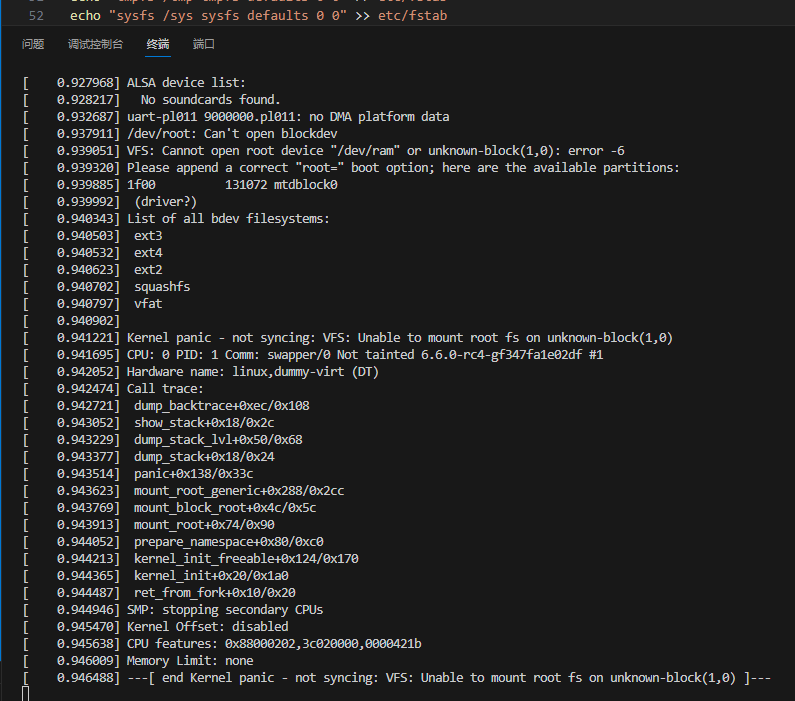

# Learn Rust-for-Linux

## day 1

今天的目标是编译并在`Qemu`上运行`kernel`。
源码相当大，有4.5G，还需要给生成留出空间，感觉至少得给20G。
编译`Qemu`

```shell
git clone git@github.com:qemu/qemu.git
cd qemu
mkdir build
cd build
../configure --target-list=riscv64-softmmu,riscv64-linux-user,aarch64-softmmu
make -j4
sudo make install

```

编译`BusyBox`：

```shell
wget https://busybox.net/downloads/busybox-1.36.1.tar.bz2
tar xvf busybox-1.36.1.tar.bz2 
cd busybox-1.36.1/
make  ARCH=arm64 menuconfig -j4
make  ARCH=arm64 install -j4

```

基于BusyBox制作initrd
制作`initrd`步骤略多。这里`make_initrd.sh`就是用来自动制作`initrd`的脚本，内容：
```shell
#!/bin/bash

MOUNT_DIR=mnt
CURR_DIR=`pwd`

rm initrd.ext4
dd if=/dev/zero of=initrd.ext4 bs=1M count=32
mkfs.ext4 initrd.ext4

mkdir -p $MOUNT_DIR
mount initrd.ext4 $MOUNT_DIR
cp -arf busybox-1.35.0/_install/* $MOUNT_DIR

cd $MOUNT_DIR
mkdir -p etc dev mnt proc sys tmp mnt etc/init.d/

echo "proc /proc proc defaults 0 0" > etc/fstab
echo "tmpfs /tmp tmpfs defaults 0 0" >> etc/fstab
echo "sysfs /sys sysfs defaults 0 0" >> etc/fstab

echo "#!/bin/sh" > etc/init.d/rcS
echo "mount -a" >> etc/init.d/rcS
echo "mount -o remount,rw /" >> etc/init.d/rcS
echo "echo -e \"Welcome to ARM64 Linux\"" >> etc/init.d/rcS
chmod 755 etc/init.d/rcS

echo "::sysinit:/etc/init.d/rcS" > etc/inittab
echo "::respawn:-/bin/sh" >> etc/inittab
echo "::askfirst:-/bin/sh" >> etc/inittab
chmod 755 etc/inittab

cd dev
mknod console c 5 1
mknod null c 1 3
mknod tty1 c 4 1

cd $CURR_DIR
umount $MOUNT_DIR
echo "make initrd ok!"

```

然后必须 `sudo` 执行 `sudo ./make_inird.sh`

接着，`Qemu`启动！

```shell
qemu-system-aarch64 \
    -nographic \
    -M virt \
    -cpu cortex-a57 \
    -smp 2 \
    -m 4G \
    -kernel /mnt/sdb/dev/linux/build/arch/arm64/boot \
    -append "nokaslr root=/dev/ram init=/linuxrc console=ttyS0" \
    -initrd disk.img
```



果然第一次就失败了。似乎是文件系统没做对